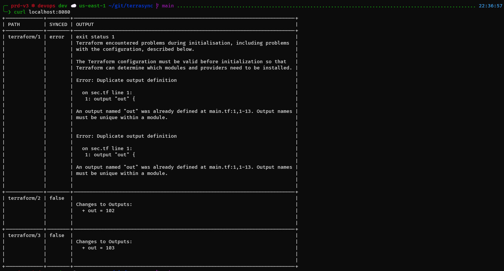
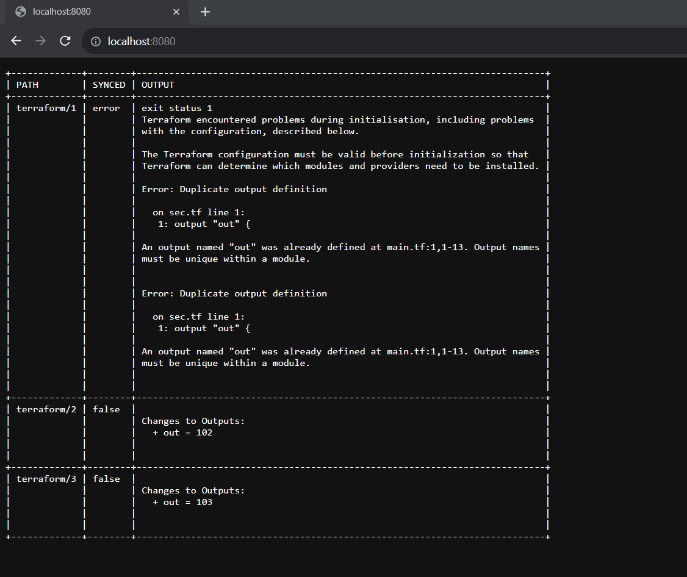

# terrasync

## Sumary
- [The idea](#the-idea)
- [The pain](#the-pain)
- [The plan](#the-plan)
- [How to develop](#how-to-develop)

## The idea
Terraform free open source drift-detection service.

[](https://asciinema.org/a/AKGJH74SrRB0OGIe0l9PDredC)



## The pain
As DevOps, we take much care building pipelines with Terraform that works with git flows. However, as opposed to AWS CloudFormation or Terraform Enterprise, for example, we have no free open source drift-detection service, and so we are blind to changes in our infraestructure, specially inside the folders we don't access so much.

## The plan
- This application will drift-detect changes between your Terraform code and state and your live environment.
- This will be done throught `terraform plan`ing recursively across all directories with `.tf` files from a specified root path.
- The planning should be done using go routines, for all directories must be evaluated  at the same time (something like assync or multi-thread), if possible.
- The application will receive an Git repository URL for cloning as the specified root path.
- If the application does not receive an Git repository URL, it will assume the root directory is already mounted. If not, error.
- The application will attempt to `git remote show origin` if the root path directory has a `.git`. If it returns a remote repository, the application will `git pull` before every `terraform plan`.
- The application will be divided into backend and frontend servers.
- The backend server will serve state objects as HTTP/API and the frontend server will consume it to show a simple web page with sync, out of sync or error terraform directories.

## How to develop

Packages I use:
- Go 1.21.1
- GNU Make 4.2.1
- Docker 24.0.6

```bash
git clone --depth 1 https://github.com/davimmt/terrasync
# init, build and run
make
# if you want to build and run in docker
make docker
```

## Features to ~maybe~ add
- [ ] Tests
- [ ] Pipeline to build and push container image somewhere
- [ ] Pre-hook scripts
    - In case files need to be changed before running terraform commands
- [ ] Post-hook scripts
    - In case pipelines need to be trigged based on state
- [ ] Slack notifications
- [ ] SMTP notifications
- [ ] Terragrunt support
